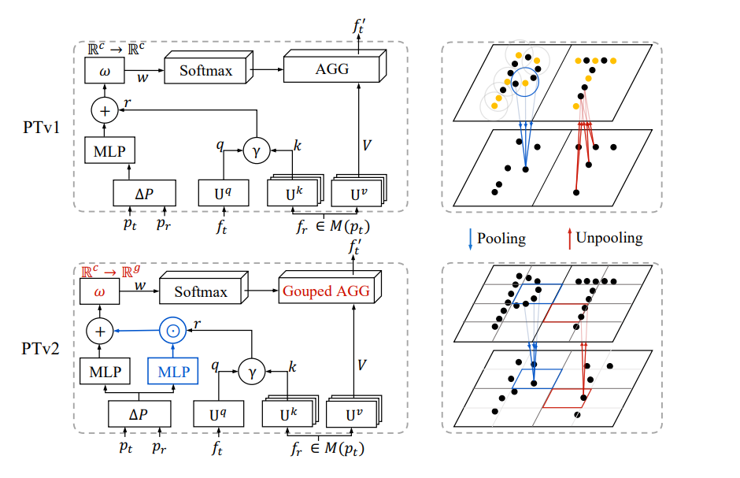

# 今日任务
## 1.c++第四章学完了数组字符串以及string
## 2.阅读文献一篇，总结如下
|论文信息|Bibtex|解决问题|网络框架（创新点）|具体实验|评价指标|下游任务|框架图|融合地点|
|-------|----|--------|-----------------|-------|--------|-------|------|--------|
|Point Transformer V2: Grouped Vector Attention and Partition-based Pooling |@article{wu2022point title={Point transformer v2: Grouped vector attention and partition-based pooling}, author={Wu, Xiaoyang and Lao, Yixing and Jiang, Li and Liu, Xihui and Zhao, Hengshuang}, journal={Advances in Neural Information Processing Systems}, volume={35}, pages={33330--33342}, year={2022}}|之前point transformer的局限：1.原来的注意力曾使用MLPs将qk映射到注意力权重向量中去，以此来调整value的输出通道。但是随着模型越来越大，通道数也增加，参数也增加，容易造成参数溢出以及限制了模型的深度。2.对于点的池化来说都是基于采样+相邻查询的方法，这样费时费力；3.全局注意力对于稀疏点来说其实是一种资源浪费；4.swt架构忽略了点的稀疏性以及收到了在空间中点的稠密以及连续性的限制。|1.首次提出组群向量注意力GVA;2.增强了位置信息嵌入，即设计了一个位置编码乘法器；3.设计了一个基于分区的池化方案来更好的进行空间对齐以及下采样|1.沿用PTv1所使用的相邻注意力机制。2.向量注意力机制的主要摸底使用权重编码函数将query和Key的关系编码到向量中去。在VA中，还另外使用了一个hadamard函数在channel聚合前为每个权重计算注意力。3.GVA其实是向量注意力＋多尺度注意力。收到多尺度注意力的权重嵌入函数启发，提出了一个组线性层，即输入向量不同的组贝单独投影。--减少权重嵌入时的参数，最终GVA的组成为：linear(composition)act(composition)norm(group linear layer(r))。r表示的是相关点。4.位置嵌入乘法器。原来的位置嵌入是把相对位置作为一个偏执加到上述的GVA中，但是相对位置乘法器对提出了一个乘法模块致力于学习复杂点云的位置关系，作为一个权重去和r进形hadamard计算。4.分区池化策略：将输入分成不重叠统一的网格，在网格内进行池化操作，对特征先进性线性投影在进行最大池化，对位置信息直接进行平均池化。在解池化中不对位置进行处理，只对特征采用相同的池化操作进行映射。整个网络框架采用的是unet-skip connections ，4个编-解码器。|miou|语义分割和目标检测|  |单雷达|
|对Lidar点云的球形transformer|目前很多的算法都面临：信息不连续以及感受野受限问题，尤其是对远距离点。|创新点：主要学习不同稀疏分布的激光雷达点云并直接使用sphereformer来直接聚合从远处到进出的信息。1.辐射窗口自注意力分区---新的分区策略，窄而长的窗口，扩大感受野，其更流畅和更显著，极大增强了远处稀疏的点云表现性能；2.为了适配辐射窗口自注意力分区，为细粒度的位置编码提出一个指数分割和动态特征选择模块。|整个网络框架：目标检测算法：参考的是centerpoint基线，四个stages，通道数变化为[16,32,64,28]在第二个和第三个阶段的末尾增加所提出的模块。1.球形transformer架构：不同于方块的3D分区策略，该模型将点云场景构造成一个球形，坐标参数为（r, θ， Φ），分区策略为辐射分区策略，狭长的金字塔形状（不重叠）。对每个token使用窗索引，拥有相同的索引的token会被放到相同的窗口中，然后使用多头自注意力机制为每个窗口进行单独计算，最后将所有的头拼接再过一层线性映射；2.指数分割的位置嵌入方法，以r轴为例，如果使用统一的等距分割，可能会面临两个key在一个索引里，但是实际上它们还是有一段距离的，所以指数分区策略能够保证更细粒度的优化近处的点，有同事保证分隔点数量不变。位置嵌入还是对相对位置进行处理。3.动态特征选择：其实上述的策略还是对远处的点更有作用，但是近处的点使用方块局部注意力还是更好一些，所以将所有头分成两份，前半部分头进行辐射窗口自注意力计算，后半部分使用方块窗口自注意力计算。经过自注意力处理后的特征进行concat，然后再通过后续处理。 整个模块是一个即插即用的模块，可以在现存的网络中使用，并达到了不错的效果。|nuscenes,miou精度已经达到蛮高了|语义分割和目标检测|  |单Lidar|

# 明日任务
## 1.c++第四章的学习
## 2. 今天数据集完整版的下载了两整天了，还差10个G，明天下完就开始跑球形transformer。
 
