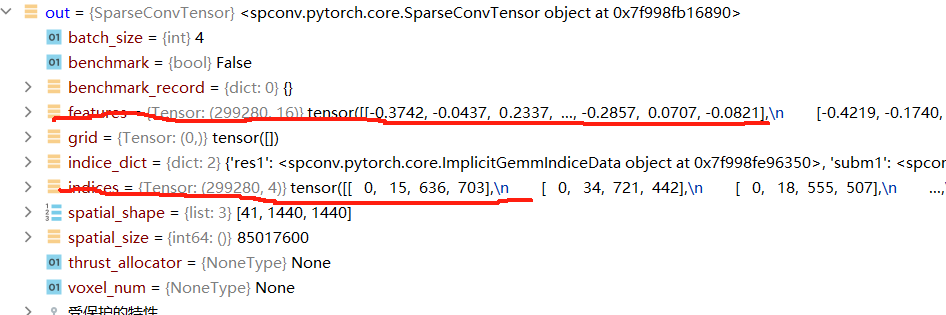

# VoxelResBackBone8xSphereFormer
## 1.SparseBasicBlock
1.得到的voxel_feature和voxel_coords送入稀疏卷积网络得到稀疏tensor    
batch_dict内容：  

2.稀疏tensor送入一个卷积网络中，得到一个x  x的输出通道为16
  
    
  conv_input 函数如下所示  

3.x送入网络conv1中 conv1函数如下所示  --此处卷积不改变通道数

  
algo fp32_accum是干什么用的 ？dilation?--膨胀卷积扩大感受野  
out = self.conv1(x)结果  
x:  

out:是对特征中间的0矩阵进行了一些填充吗?
    
replace_feature函数是线性层和归一化层的作用：
  
归一化后
  
通过线性层后  
  
4.out 送入conv2中，函数快儿如下
  

5.不进行下采样
6.block输出？  

再前向传播最初的地方已经将x传入identity[即处理了体素之后的稀疏张量]

再通过一个线性层

**block 返回一个out**
稀疏卷积块框架如下：  

处理之后的x与x_conv1对比:

## 2.SparseSequential依然是稀疏卷积块
1.前期处理  
  
取体素特征的第二维度0、1、2维度数据传入xyz，取voxel_coords第0为维度数据即batch_size传入batch。  

2.x_conv2=self.conv2(x_conv1)

//卷积计算输出公式// 对空间shape进行处理输入41 1440 1440 输出

  
此处的conv2调整通道 16->32 同时处理了空间形状  
然后便是两个稀疏卷积块进行处理  
  
x_conv1到x_conv2的处理结果展示：  

  
## 3.下采样  
1.索引对？  
在x_conv1和x_conv2中都会有索引对，其中1中只有两个字典即subm1和res1，而x_conv2中有四个，如下所示:  

通过指令读取其中spocnv2作为索引对，spconv2字典包含的东西如下所示

indice_pair形状内容如下所示：

2.下采样操作：  

  
读取索引对里面的第0维和第1维的东西作为pair_in pair_out

 输入对中的不是-1的部分传给valid_mask  
   
    valid_pair_in, valid_pair_out = pair_in[valid_mask].long(), pair_out[valid_mask].long() 提取Pair_in pair_out中为ture的张量，并存储为长整型。
   
 xyz_next = scatter_mean(xyz[valid_pair_in], index=valid_pair_out, dim=0) 将xyz在输入对上的张量进行平均计算并且分散到输出对位置上去。输出结果如下所示:
 
batch同理：

**下采样桉树返回xyz_next和batch_next**
## 3.开始sphereformer了

sphereformer块如下：

首先将特征被备份到short_cut中去，送到第一层归一化层进行处理；处理前后对比下图所示：

### 1.sparsetrtensor--将什么设置成q\k\v？

### 2.对sptr_tensor使用注意力机制
q、k、v都是稀疏张量中的qkv特征，但是实际上只有query特征有东西

处理好的数据通过下面的指令：

其中self.qkv操作为：可以看到qkv自己是一个升维度的过程，理论上来说总维度也提升了3，看看后续操作

qkv的三维度信息分给query,key,和value

然后query×一个缩放系数 scale=0.25

### 3.xyz坐标转换 -- 转换到球面坐标系
  
转换前后：
  
### 4.索引参数：  

key非空且不在索引字典里，故返回一个None值：

如果索引参数是None，则对其他参数这样处理：

get_indices_param函数：

输入：

--1如果window_size参数存在，不论是List还是ndarray，都将其存到xyz所在的设备上去。  
--2shift_win为false，则else的方式处理参数。  
grid_sample函数如下：

voxel_grid函数--使用用户定义的标准网格来对点云进行聚类：输入参数围为pos,size,start,end，其中后两个参数都设置为None。本次的操作为读取了pos[0]即点数传给了num_nodes,pos[1]传给了dim，然后将batch信息嵌入到pos[1]中，且size增加一个维度，由三维到4维。使用grid_cluster来聚合上述信息给到一个输出，voxel_gird输出结果为：
  
然后使用unique函数将cluster中的函数进行升序排序到unique中，生成索引张量cluster和计数张量counts。如下所示：  

然后返回cluster计数最大的数以及counts。
grid_sample最终结果如下：即v2p_map则为cluster所保存的索引，k即为counts的最大计数，counts即为counts。

**v2p_map, sort_idx = v2p_map.sort()** 对v2p_map进行升序排序，并将索引存入sort_idx中。   
将counts的大小传入n中， v2p_map大小传入N中。k传入n_max.
**index_0_offsets, index_1_offsets, index_0, index_1 = precompute_all(N, n, n_max, counts)** 使用上述参数以及percompute_all函数计算出结果传到索引和索引偏置中去。  
percompute_all函数:

offsets 和sq_offsets是通过将connts增加一个零累加以及先平方之后再累加得到的。**索引1，2如何得到的有点费解，是通过一个precompute_all_cuda函数得到的** 再看看。  
得到了index_0,index_1将其转化成long形并返回。  
----------------------第一个索引参数读取完毕了------------------  
--------------------------球形索引参数读取-------------------  

处理方式和第一个索引参数读取一样，唯一不同的是窗口设置不同，window_size_sphere设置的大小为[3. 3. 120]
处理后的结果为：
