# VoxelResBackBone8xSphereFormer
## 1.SparseBasicBlock
1.得到的voxel_feature和voxel_coords送入稀疏卷积网络得到稀疏tensor    
batch_dict内容：  

2.稀疏tensor送入一个卷积网络中，得到一个x  x的输出通道为16
  
    
  conv_input 函数如下所示  

3.x送入网络conv1中 conv1函数如下所示  --此处卷积不改变通道数

  
algo fp32_accum是干什么用的 ？dilation?--膨胀卷积扩大感受野  
out = self.conv1(x)结果  
x:  

out:是对特征中间的0矩阵进行了一些填充吗?
    
replace_feature函数是线性层和归一化层的作用：
  
归一化后
  
通过线性层后  
  
4.out 送入conv2中，函数快儿如下
  

5.不进行下采样
6.block输出？  

再前向传播最初的地方已经将x传入identity[即处理了体素之后的稀疏张量]

再通过一个线性层

**block 返回一个out**
稀疏卷积块框架如下：  

处理之后的x与x_conv1对比:

## 2.SparseSequential依然是稀疏卷积块
1.前期处理  
  
取体素特征的第二维度0、1、2维度数据传入xyz，取voxel_coords第0为维度数据即batch_size传入batch。  

2.x_conv2=self.conv2(x_conv1)

//卷积计算输出公式// 对空间shape进行处理输入41 1440 1440 输出

  
此处的conv2调整通道 16->32 同时处理了空间形状  
然后便是两个稀疏卷积块进行处理  
  
x_conv1到x_conv2的处理结果展示：  

  
## 3.下采样  
1.索引对？  
在x_conv1和x_conv2中都会有索引对，其中1中只有两个字典即subm1和res1，而x_conv2中有四个，如下所示:  

通过指令读取其中spocnv2作为索引对，spconv2字典包含的东西如下所示

indice_pair形状内容如下所示：

2.下采样操作：  

  
读取索引对里面的第0维和第1维的东西作为pair_in pair_out

 输入对中的不是-1的部分传给valid_mask  
   
    valid_pair_in, valid_pair_out = pair_in[valid_mask].long(), pair_out[valid_mask].long() 提取Pair_in pair_out中为ture的张量，并存储为长整型。
   
 xyz_next = scatter_mean(xyz[valid_pair_in], index=valid_pair_out, dim=0) 将xyz在输入对上的张量进行平均计算并且分散到输出对位置上去。输出结果如下所示:
 
batch同理：

**下采样桉树返回xyz_next和batch_next**
## 3.开始sphereformer了

sphereformer块如下：

首先将特征被备份到short_cut中去，送到第一层归一化层进行处理；处理前后对比下图所示：

### 1.sparsetrtensor--将什么设置成q\k\v？

### 2.对sptr_tensor使用注意力机制
q、k、v都是稀疏张量中的qkv特征，但是实际上只有query特征有东西

处理好的数据通过下面的指令：

其中self.qkv操作为：可以看到qkv自己是一个升维度的过程，理论上来说总维度也提升了3，看看后续操作

qkv的三维度信息分给query,key,和value

然后query×一个缩放系数 scale=0.25

### 3.xyz坐标转换 -- 转换到球面坐标系
  
转换前后：
  
### 4.索引参数：  

key非空且不在索引字典里，故返回一个None值：
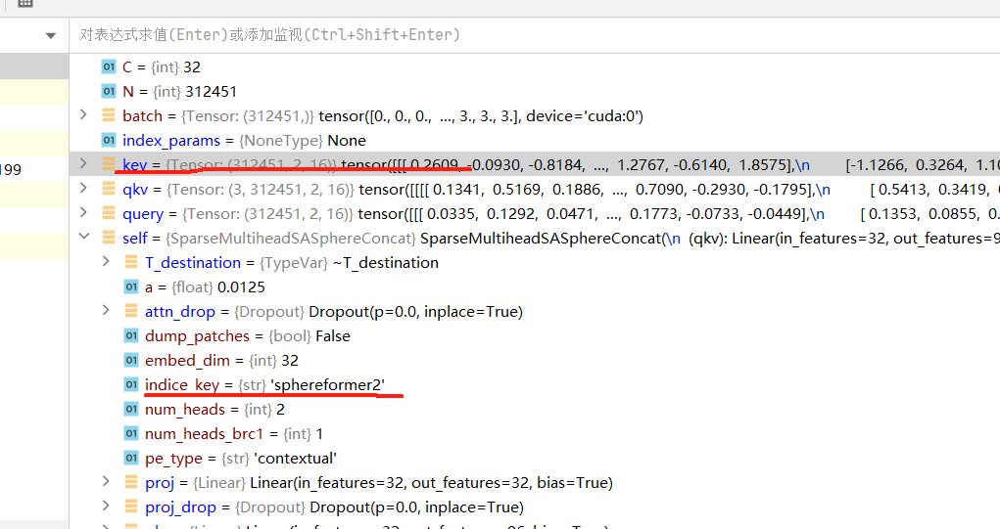
如果索引参数是None，则对其他参数这样处理：

get_indices_param函数：

输入：

--1如果window_size参数存在，不论是List还是ndarray，都将其存到xyz所在的设备上去。  
--2shift_win为false，则else的方式处理参数。  
grid_sample函数如下：

voxel_grid函数--使用用户定义的标准网格来对点云进行聚类：输入参数围为pos,size,start,end，其中后两个参数都设置为None。本次的操作为读取了pos[0]即点数传给了num_nodes,pos[1]传给了dim，然后将batch信息嵌入到pos[1]中，且size增加一个维度，由三维到4维。使用grid_cluster来聚合上述信息给到一个输出，voxel_gird输出结果为：
  
然后使用unique函数将cluster中的函数进行升序排序到unique中，生成索引张量cluster和计数张量counts。如下所示：  

然后返回cluster计数最大的数以及counts。
grid_sample最终结果如下：即v2p_map则为cluster所保存的索引，k即为counts的最大计数，counts即为counts。

**v2p_map, sort_idx = v2p_map.sort()** 对v2p_map进行升序排序，并将索引存入sort_idx中。   
将counts的大小传入n中， v2p_map大小传入N中。k传入n_max.
**index_0_offsets, index_1_offsets, index_0, index_1 = precompute_all(N, n, n_max, counts)** 使用上述参数以及percompute_all函数计算出结果传到索引和索引偏置中去。  
percompute_all函数:

offsets 和sq_offsets是通过将connts增加一个零累加以及先平方之后再累加得到的。**索引1，2如何得到的有点费解，是通过一个precompute_all_cuda函数得到的** 再看看。  
得到了index_0,index_1将其转化成long形并返回。  
----------------------第一个索引参数读取完毕了------------------  

--------------------------球形索引参数读取-------------------  

处理方式和第一个索引参数读取一样，唯一不同的是窗口设置不同，window_size_sphere设置的大小为[3. 3. 120]
处理后的结果为：
    

----------------------信息存入self.kwags------------------  
处理之后将其写入字典：
  
识别pe_type是否等于"contextual"，并更行参数字典kwargs  
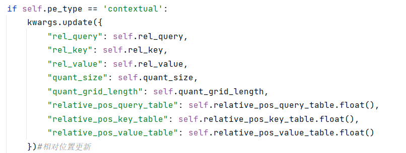
相对位置信息如下所示：  
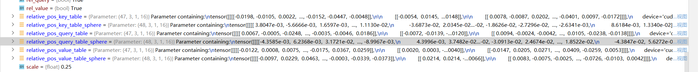    

  

------使用**kwags做稀疏自注意力机制存入Out1---------  
1.q\k\v按照sort_idx索引来进行排序。  
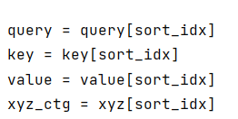  
2.检索字典并处理。

---windowsize。转成浮点型并存入cuda;---  
---shift_size=0;  ----  
---xyz_quant则是通过xyz_ctg-xyz_ctg再第0维度上的最小值然后对window_size取余得到的。  
计算结果如下：    
再使用xyez_quat除以quant_size 结如下所示：
  
---相对位置计算 使用xyz_quant[index_0]-xyz_quat[index_1]进行计算。最后的输出形状为（M,3）M由索引决定。因为index的维度远远大于xyz_quant[0]维度的，所以一定会有很多索引位置的计算结果为0.  

---相对位置偏移索引等于相对位置+quant_grid_length-1，其中qgl=24,计算结果如下：（因为split_func为none，所以不做if下面语句处理。）

---attn_flat ------  
----dotprodwithidxall函数如下-----：

qkv与其对应的索引连续，将q的shape赋值给N,h,dim即点数、 、 维度  
M为index_k的shape，L为talbe_q的shape[0];  
保证tabel_k.shape[0]=table_q.shape[0],且q.shape[0]=k.shape[0];  
确保L大于rel_idx.max 小于等于50。  
使用output存放一个(h,M)==>(1,index_k.shape[0])的零矩阵。  
q,k重新排序得到q_transpose和k_transpose，形状从（218265，1，16）==>(1,16,218265)  
table_q和table_k维度也换，(47,3,1,16) == > (1,16,3,47)  
rel_idx也换 从（8632855，3）==>（3，8632855）  
将这些数据都使用**dout_prob_with_idx_all_forward_cuda** 函数传递给output,output结果为如下：

进行转置处理。   
ctx.n_max= n_max = 210
ctx来保存这些参数为了for_backward。该函数返回一个output到attn_flat。  
------dotprodwithidxall函数运行结果。---------  
---attn_flat结束  
---softmax_attn_flat---  
  
在索引index_0_offset上对attn_falt进行soft_max计算，计算结果如下所示:
  
------------------------------softmax计算结束-----------------------------------  
-----------------attnstep2--使用相对位置值进行计算----------------------  
  
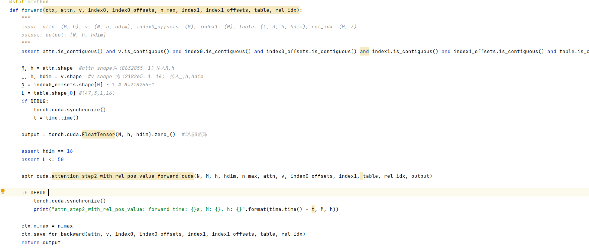
也是将output返回给x,x的结果为：  
  
-------------------------attnstep2结束-------------------------  
稀疏自注意力机制运行结果：  
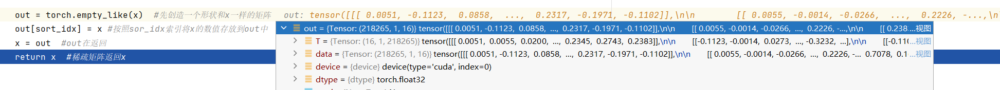
------------------**最终返回的x给out1** --------------------------------
  
---------------------out2---球形注意力机制的处理--------------------  
1.参数传入字典,参数如下所示：注：原来的q\k\v的第二个维度都为1，但是此处使用了 **query[:, self.num_heads_brc1:].contiguous().float(),#query.shape[258355,2,16]** 即论文中所提到的将头分半的动作

中间也是通过一个sparse_self_attention对(**kwags)进行处理，参考out1的部分。输出结果如下所示:  
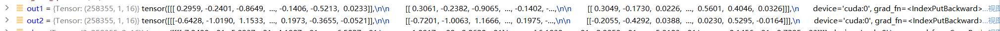  
----------------out2球形注意力机制处理------------------------  

在通道维度上将out1,out2在通道维度进行concat  
    
线性投射和proj_drop
  
  

转换成稀疏张量：  
  
--------------------------------------------------  结束----  
sptr_tensor = slef.attn(sptr_tensor)：处理前后  
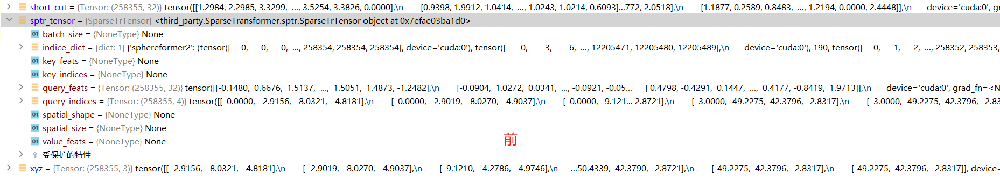  

输出特征也是采用的resnet处理方式，short_cut即保存的最初的特征。  
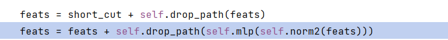  
mlp如下所示：  
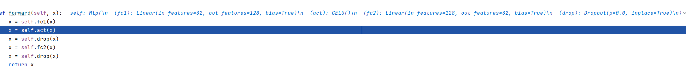  
运行结果如下所示：  
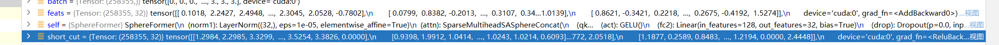

整个transformer_block大概框架整理如下图所示：  
    
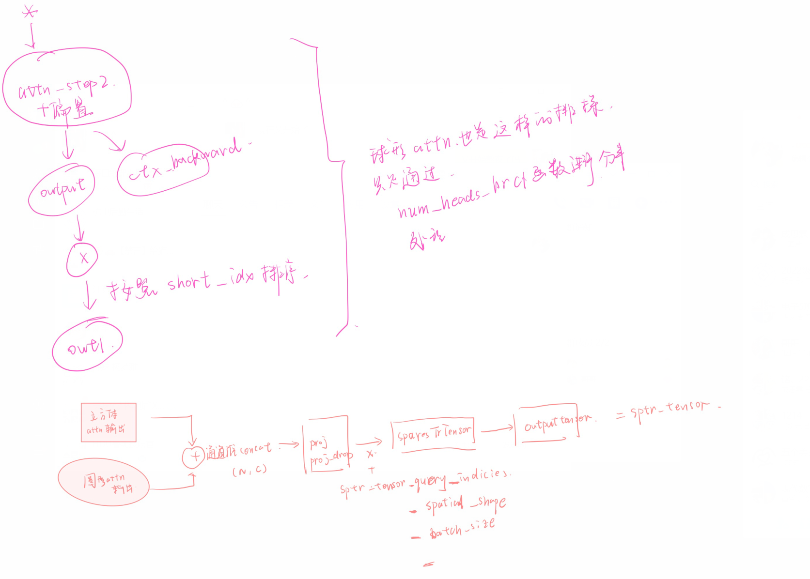  
其中比较重要的两个计算使用cuda实现，第一个则是计算索引：**precomputer**，以及在所有索引上并行计算特征函数**dot_prod_with_idx**

------使用replace_feature函数将上面得到的feats传递给x_conv2.  

## x_conv3 = slef.conv3(x_conv2)
conv3整个框架：
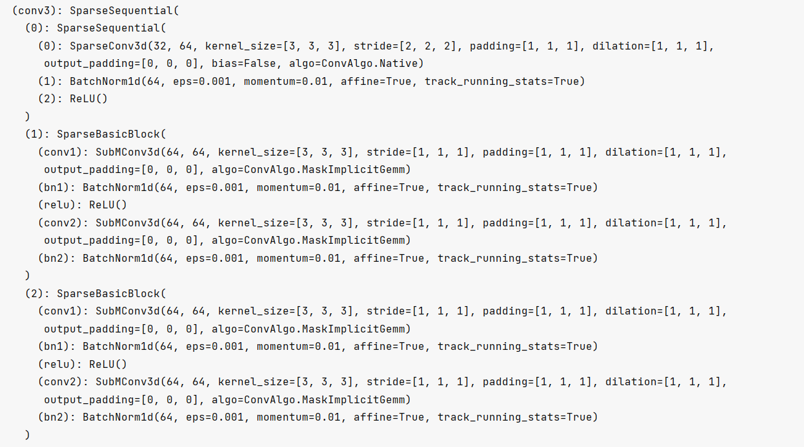  
  
### 0 )sparsesequential
  
output_size计算公式如下：高宽减半、通道数*2
 
### 1、2)稀疏卷积块 --难点 如何获得索引并关联
稀疏卷积的前向传播：  
1.确定--判断输入是一个稀疏卷积张量；输入特征的第一维度不为0；将输入特征值，特征设备以及特征索引，空间形状还有批量大小都传给输入参数。关注此时indices属性中的内容。  
  
2.因为self.subm以及transposed皆为零，通过函数ops.get_conv_output_size获得输出空间大小为（11，360，360）  
3.将输入的张量通过shadow张量复制到output_tensor中。  
4.输入benchmark是false以及conv1*1都是none，所以直接使用replace_feature将特征传入到output_tensor中，以及传入Out_put_shape属性。  
5.输入索引字典indice_dict进行复制。algo=slef.algo=native  
6.idicie_key存在为spconv3，所以对datas使用find_indice_pair,返回一个None值给datas。  
7.profile_ctx = nullcontext()不知道在干嘛，但是需要使用profile_ctx  
---使用algo==convalgo.native;再次使用find_indice_pair给datas填充None，然后一系列判断语句只能执行这个： 
  
函数如下所示：  
  

  
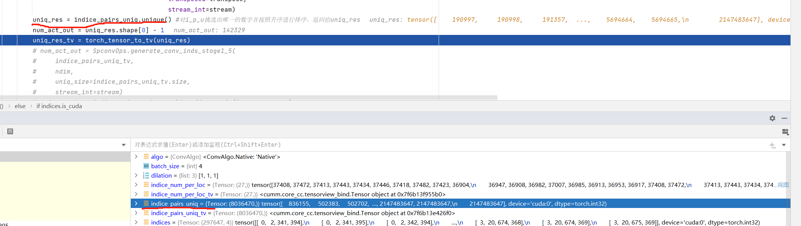

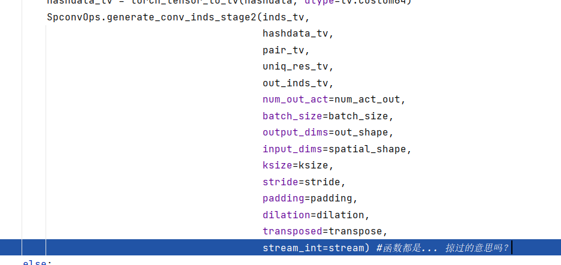  
然后返回out_inds,pair,indice_num_per_loc三个参数。具体情况如下：  
  
8.索引数据生成使用indice_data = IndiceData（输入们），具体输入参数：其实就是把这些参数传图到indice_data中去。 
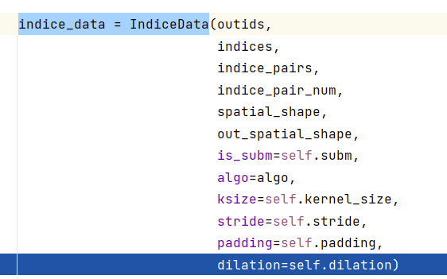   
  

9.输出特征：  
（1）首先将数据备份  
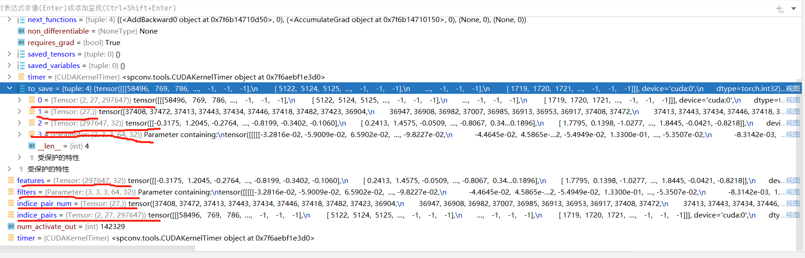  
（2）通过ops.indicie_conv对输入进行处理
  
  
  

  
 
返回的是Out_features.  
（3）profile_idx = kv_center 就是kv值除2。  
nhot_profile = indice_pair_num_cpu[profile_idx] 取索引等于13即第十四个数传给它。  

（4）gemm.get_tuned_algo（）函数tuned_res为NONE   
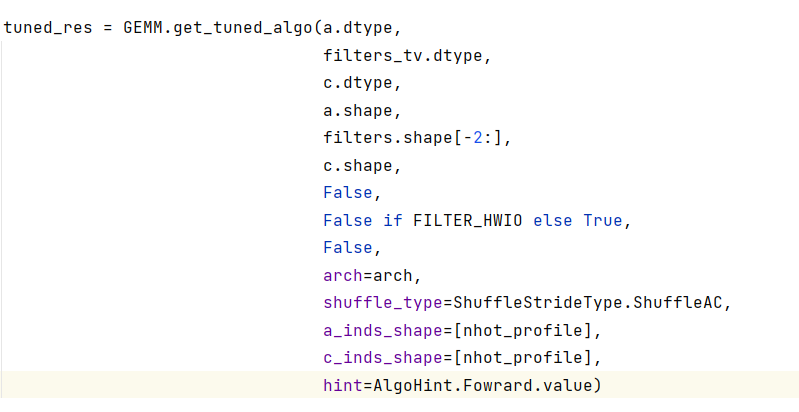  

（5）run profile on center  
------------------------一堆底层的东西-------------  
 x_conv3 = self.conv3(x_conv2) 得到的结果基本上都减半了：  
   
 然后将spconv3加入索引字典中，进行下采样操作。和之前的都同理。  
 运行transformer_block:  
 也是和之前一样通过索引来分别进行上下两个头的操作，最后在通道维度上进行相加。  
 特征填充：x_conv3 = x_conv3.replace_feature(feats)
  
  ----------------x_conv4-----------------------  
  x_conv4 = self.conv4(x_conv3)  
  conv4网络如下所示：  
  
运行结果对比如下所示：  
  
out = self.conv_out(x_conv4)  
conv_out网络如下所示:  
  
运行结果：  
  
  
构建batch_dict传送到centerpoint网络中去进行目标检测的任务：  
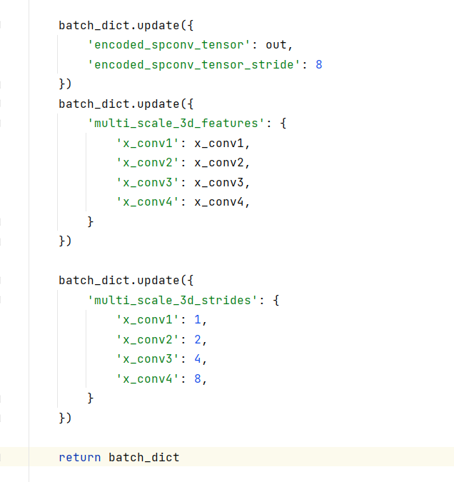  

 